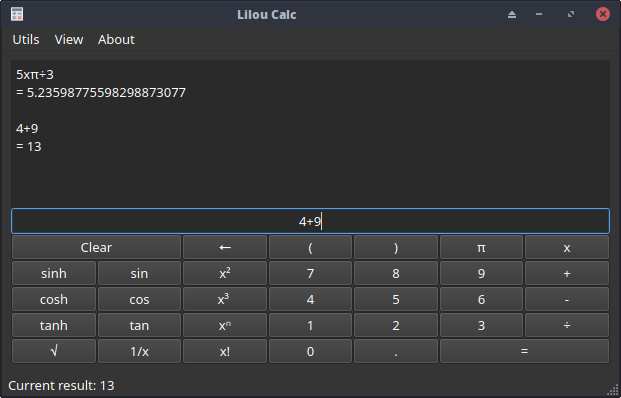

# LilouCalc

[](https://github.com/Antidote1911/liloucalc/actions/workflows/build.yml)
[](https://github.com/Antidote1911/liloucalc/releases/latest)
[](LICENSE)

Une calculatrice scientifique multiplateforme écrite en C++20 et Qt6.



## Fonctionnalités

- Saisie par expression avec support complet des parenthèses
- Fonctions scientifiques : trigonométrie, logarithmes, puissances, factorielles
- Résolveur d'équations
- Conversions d'unités (longueur, masse, temps, énergie, pression, et plus)
- Variables et fonctions définies par l'utilisateur
- Bibliothèque de constantes
- Historique de session
- Thème sombre, clair et système
- Multiplateforme : Linux, macOS, Windows

Le moteur d'expressions et le système d'unités sont dérivés du projet [SpeedCrunch](https://speedcrunch.org/).

## Téléchargement

Des binaires pré-compilés sont disponibles sur la page [Releases](https://github.com/Antidote1911/liloucalc/releases) :

| Plateforme | Format |
|------------|--------|
| Linux      | AppImage |
| macOS      | DMG (universel arm64 + x86_64) |
| Windows    | ZIP (MinGW) |

## Compilation depuis les sources

### Prérequis

- CMake ≥ 3.16
- Qt6 (Core, Widgets, Gui, Svg)
- GSL (GNU Scientific Library)
- Un compilateur C++20

### Linux

```bash
sudo apt install libgsl-dev
cmake -B build -DCMAKE_BUILD_TYPE=Release
cmake --build build --parallel
```

### macOS

```bash
brew install gsl qt6
cmake -B build -DCMAKE_BUILD_TYPE=Release
cmake --build build --parallel
```

### Windows (MSYS2 MinGW64)

```bash
pacman -S mingw-w64-x86_64-gcc mingw-w64-x86_64-qt6-base mingw-w64-x86_64-qt6-svg \
          mingw-w64-x86_64-qt6-tools mingw-w64-x86_64-gsl mingw-w64-x86_64-cmake \
          mingw-w64-x86_64-ninja
cmake -B build -G Ninja -DCMAKE_BUILD_TYPE=Release -DCMAKE_PREFIX_PATH=/mingw64
cmake --build build --parallel
```

## Licence

GPL-2.0-or-later
