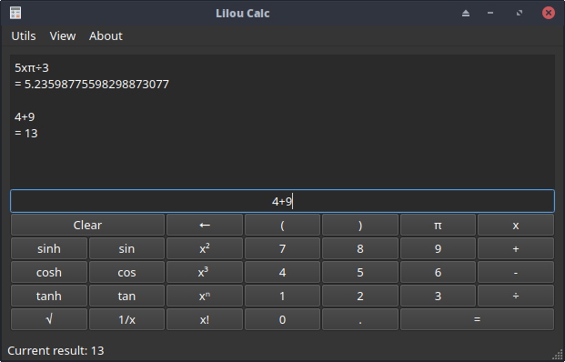

# LilouCalc

A real simple scientific calculator written in C++ and Qt5

# Functions

* Basic add, subtract, multiply and division
* Square, Cube, Power to N, Factorial
* Sine, Cosine, Tangent and reverse of them
* Memory Save, Recall and Clear
* Parenthesis support
* Dark theme

The core engine and expression parsing are provided by the [SpeedCrunch](https://speedcrunch.org/) project.
